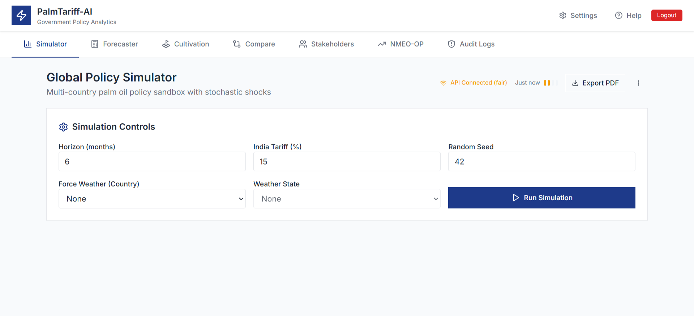
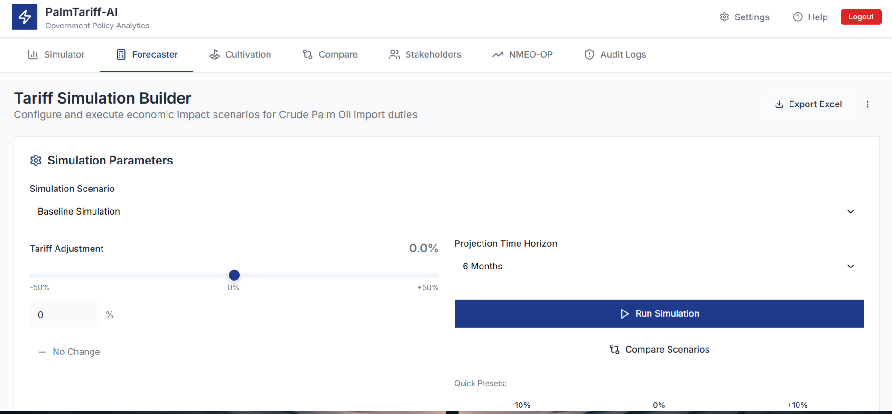
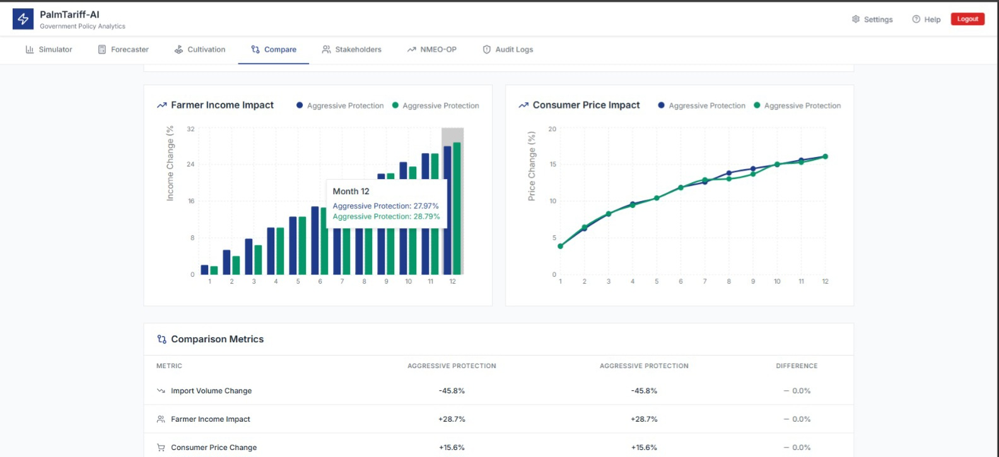
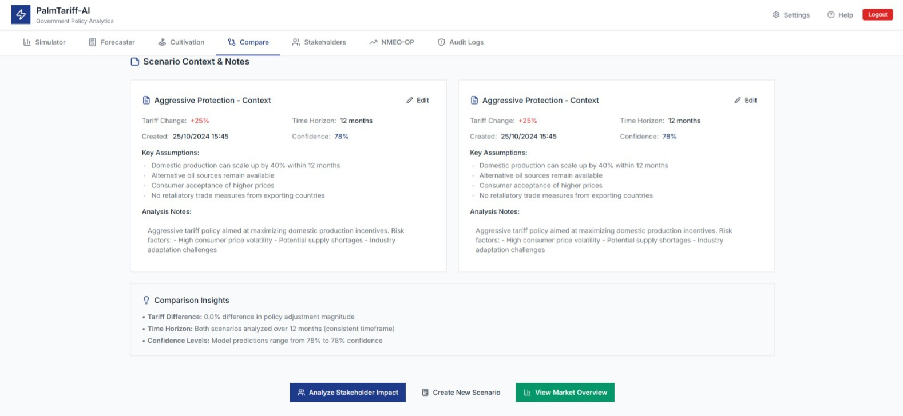
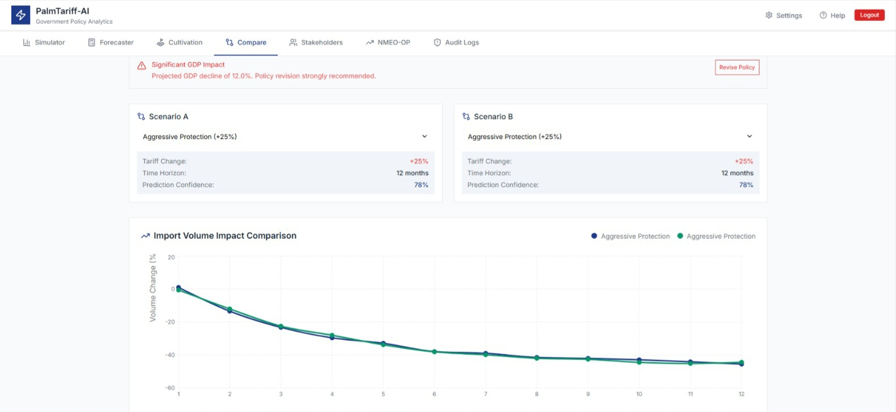
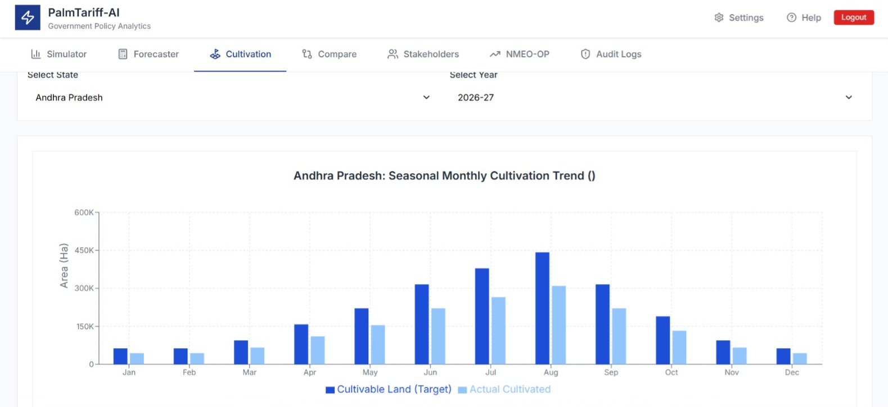

# 🚀 SIH 2026 – Policy Intelligence & Tariff Simulation Dashboard

> An AI-powered decision support system for policy analysis, tariff simulation, and stakeholder impact evaluation.

---

## 📸 Demo & Screenshots








---

## 📌 Problem Statement

Policy and tariff analysis is traditionally:
- Time-consuming  
- Static and non-interactive  
- Lacking real-time simulation capabilities  

Decision-makers struggle to evaluate **multiple scenarios and stakeholder impacts efficiently**.

---

## 💡 Our Solution

We built an **intelligent dashboard** that combines:

- 📊 Interactive data visualization  
- 🔄 Scenario-based tariff simulation  
- 🤖 AI-assisted insights  
- 📈 Stakeholder impact analysis  

This enables **real-time decision-making** for complex policy environments.

---

## ✨ Key Features

- 📊 **Overview Dashboard** – Visual insights of key metrics  
- 🔄 **Scenario Comparison** – Compare multiple policy scenarios  
- ⚙️ **Tariff Simulation Builder** – Create and test tariff strategies  
- 📈 **Stakeholder Impact Analysis** – Understand effects across sectors  
- 🤖 **AI Integration** – ML-based insights for smarter decisions  

---

## 🧠 AI / ML Component

- Machine learning models used for:
  - Trend analysis  
  - predictive insights  
  - scenario evaluation  

- Hybrid approach:
  - 🤖 AI-driven insights  
  - 🔢 Rule-based simulations (as required by judges)

---

## 🛠 Tech Stack

- **Frontend:** React (Vite), Tailwind CSS  
- **State Management:** Redux Toolkit  
- **Visualization:** Recharts, D3.js  
- **Routing:** React Router v6  
- **Forms:** React Hook Form  
- **Animation:** Framer Motion  

---

## 📁 Project Structure

sih_finals/
├── assets/ # README images (screenshots)
├── public/ # Static assets for app
├── src/
│ ├── components/
│ ├── pages/
│ ├── styles/
│ ├── App.jsx
│ ├── Routes.jsx
│ └── index.jsx
├── README.md
├── package.json
└── vite.config.js

---

## ⚙️ Run Locally

```bash
git clone https://github.com/your-username/your-repo.git
cd sih_finals
npm install
npm run dev
```

## 📊 Use Cases

- Government policy analysis  
- Economic decision support  
- Trade & tariff evaluation  
- Research and academic simulations  

---

## 🏆 SIH Highlights

- ✅ Built under Smart India Hackathon  
- ✅ Combines AI + simulation-based modeling  
- ✅ Focused on real-world policy challenges  
- ✅ Scalable and extensible architecture  

---

## 🚀 Future Improvements

- Real-time data integration  
- Advanced ML models  
- API-based policy datasets  
- User authentication & dashboards  

---

## 🙌 Team & Credits

Kavyansh Jain (Team Lead) - AI/ML
Divyanshu Pratap Singh - Backend
Arnavv Agnihotri - Backend
Aryan Singh - Frontend
Roshni Kumari - Documentation & AI/ML
Parth Agrawal - Frontend
